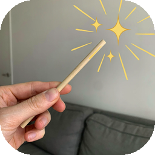

# Magic Wand

A lightweight Chrome extension (Manifest V3) adding quality-of-life features and minor fixes for YouTube and other websites. Each feature can be toggled on or off from the popup:

1. **Refresh on play** — refreshes the YouTube page once when a video starts playing, resolving playback glitches that sometimes occur on the first load of a video.
2. **Block Shorts** — hides every Shorts shelf, sidebar link, thumbnail, and tab, and redirects any `/shorts/<id>` URL to the normal `/watch?v=<id>` player.
3. **Block betting sites** — blocks gambling / betting sites (a ~253,000-domain blocklist).
4. **Media controls (any site)** — scroll over any HTML5 video to change volume (with boost above 100%), keyboard shortcuts for speed and Picture-in-Picture, and a pop-out control panel with a sleep timer. Works on YouTube, Twitch, Netflix, embeds, etc.
5. **Clean URLs** — strips tracking parameters (`utm_*`, `fbclid`, `gclid`, …) from the page URL and links.
6. **Countdown timer** — set a timer from the popup and get a desktop notification when it finishes.
7. **Dismiss cookie popups** — auto-rejects/closes consent banners and restores scrolling when a modal locks the page.
8. **QR code & color picker** — generate a QR for any link (pre-filled with the current tab's URL) and pick colors (eyedropper), right in the popup.
9. **Macros** — build a small automation (read a field → fill/click → repeat on a loop), saved per-site.

## Settings

Click the Magic Wand icon in the toolbar to open the settings popup. Each feature has its own switch; changes are saved instantly (via `chrome.storage.sync`) and apply to open YouTube tabs without needing to reopen the popup.

## How it works

### Refresh on play

A content script listens for the `play` event on the page's video element. When a video starts:

1. It reads the current video ID from the URL (`?v=...`).
2. If that video hasn't already been refreshed this tab session, it sets a flag in `sessionStorage` and reloads the page.
3. After the reload the video autoplays again, but the flag is now set — so it **does not refresh again**, avoiding an infinite reload loop.

Each distinct video triggers exactly one refresh per tab session.

### Block Shorts

- `styles.css` hides all Shorts UI (shelves, sidebar entries, thumbnails, the Shorts tab/chip). Its rules are scoped under an `html.mw-block-shorts` class that the content script toggles, so the setting takes effect instantly without a reload. The script adds the class at `document_start`, so Shorts are hidden before the page renders (no flash).
- `content.js` redirects `/shorts/<id>` URLs to `/watch?v=<id>` (both on first load and on YouTube's in-page navigations) and removes any Shorts shelves that slip through, keeping the layout gap-free.

### Block betting sites

Uses Chrome's `declarativeNetRequest` to **block** gambling / betting sites at the network level (the request is cancelled, so there's no loading and no custom page to hang).

The blocklist (`rules/betting-domains.json`) bundles **~253,000 domains** merged from [HaGeZi's gambling blocklist](https://github.com/hagezi/dns-blocklists) (the most comprehensive available), [StevenBlack](https://github.com/StevenBlack/hosts), [The Block List Project](https://github.com/blocklistproject/Lists), curated mainstream/crypto/skin operators, Swedish (Spelinspektionen) operators, and prediction markets (Kalshi, Polymarket, PredictIt, etc.). Domains are matched including subdomains.

There is no keyword matching, so there are **no false positives** on legitimate sites — a site is blocked only if its domain is on the list. `block` rules need no host permissions, so the extension doesn't request access to all your data. To add more sites, append domains to `rules/betting-domains.json`; `background.js` enables/disables the ruleset based on the toggle.

### Media controls (any site)

`media.js` runs on every site (and inside frames/embeds) and adds, for any HTML5 `<video>`:

- **Volume slider** — the popup has a volume slider (0–400%) that controls the active tab's video. Beyond 100% the audio is amplified via a Web Audio gain node (great for quiet videos). To avoid muting cross-origin media, boost above 100% only engages for same-origin or streamed (blob/MSE) sources. The level is remembered across videos and sessions. No hotkeys or mouse-wheel input are used.
- **Pop-out panel** — click **"Open media panel"** in the popup for a draggable panel with play/pause, **speed**, volume, loop, **Picture-in-Picture**, and a **sleep timer** that pauses the video after a chosen number of minutes.

Because it touches every site, this feature requires the extension to run on all URLs (Chrome will show an "all sites" access prompt). It can be turned off in the popup.

### Clean URLs

`media.js` removes tracking parameters (`utm_source`, `utm_medium`, `fbclid`, `gclid`, `mc_eid`, `igshid`, etc.) from the address bar on page load and rewrites links' `href` so the cleaned URL is what you navigate to and copy. Toggle in the popup.

### Countdown timer

The popup has a simple countdown timer. Enter minutes and press **Start**; `background.js` schedules a `chrome.alarms` alarm and shows a desktop notification when it finishes. The remaining time is shown in the popup and it can be cancelled there.

### Dismiss cookie popups

`annoyances.js` auto-dismisses cookie-consent / GDPR banners from the major consent platforms (OneTrust, Cookiebot, Quantcast, Didomi, Usercentrics, Sourcepoint, TrustArc, Osano, CookieYes, Complianz, Borlabs, Iubenda, Funding Choices, …). It **only ever clicks the reject button** (never accept) — if no reject button exists, it simply hides the banner via CSS instead. It also **restores scrolling** if the page was locked behind a modal. A short-lived `MutationObserver` catches banners that load late. Toggle in the popup.

### QR code & color picker

Both live directly in the popup and run entirely offline (nothing is sent to any server):

- **QR code** — generate a QR for any link/text (the active tab's URL is pre-filled). Uses a first-party QR encoder (`qr.js`), with PNG download.
- **Color picker** — pick any pixel on screen with the eyedropper, or choose a color; copy HEX/RGB.

### Macros

`macro.js` adds a small automation builder, opened with the popup's "Open macro builder" button. Add steps by picking elements on the page:

- **Read field** — grab a field's value (stored as the `{grabbed}` token)
- **Fill field** — type text into a field; include `{grabbed}` to insert the last read value
- **Click** — click an element
- **Wait** — pause N ms

Set a **repeat count** and **interval**, then **Run/Stop**. So "grab text from a field, type it somewhere, then repeat" is: *Read field → Fill field (`{grabbed}`) → Click → repeat ×N*. Macros are saved per-site and fields are filled in a framework-friendly way (native value setter + `input`/`change` events). Toggle in the popup.

## Installation (load unpacked)

1. Download or clone this repository.
2. Open `chrome://extensions` in Chrome (or any Chromium browser).
3. Toggle **Developer mode** on (top right).
4. Click **Load unpacked** and select this project folder.
5. Click the Magic Wand toolbar icon to choose which features are on.

## Files

| File | Purpose |
| --- | --- |
| `manifest.json` | Extension manifest (Manifest V3) |
| `content.js` | YouTube features (refresh + Shorts) based on saved settings |
| `media.js` | Site-wide media controls, pop-out panel, sleep timer, clean URLs |
| `annoyances.js` | Auto-dismiss cookie/consent popups + restore scrolling |
| `styles.css` | Hides all Shorts UI elements (toggled by a class) |
| `background.js` | Betting-site ruleset toggle + countdown timer (alarms/notifications) |
| `rules/betting-domains.json` | Betting/gambling domain blocklist (~253,000 domains) |
| `popup.html` / `popup.css` / `popup.js` | Popup: actions, volume, QR, color picker, settings |
| `qr.js` | First-party QR code encoder (no dependencies) |
| `macro.js` | Per-site macro builder (read/fill/click/wait, repeat) |
| `icons/` | Wand logo + toolbar icons |

## Notes

- Works on `www.youtube.com` and `m.youtube.com`.
- Both features default to **on** for new installs.
- The refresh flags are cleared when the tab/browser session ends.
